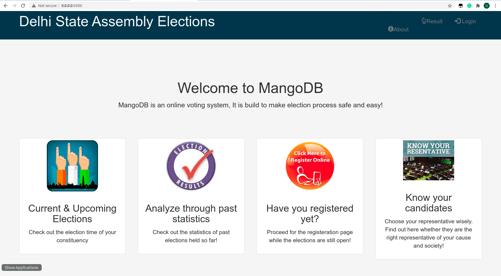
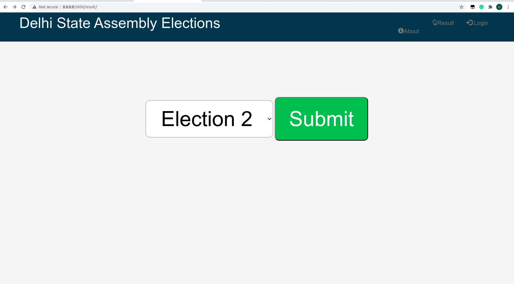
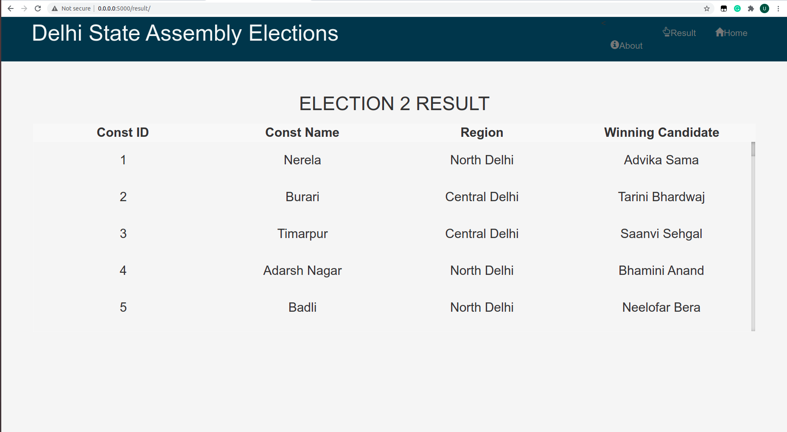
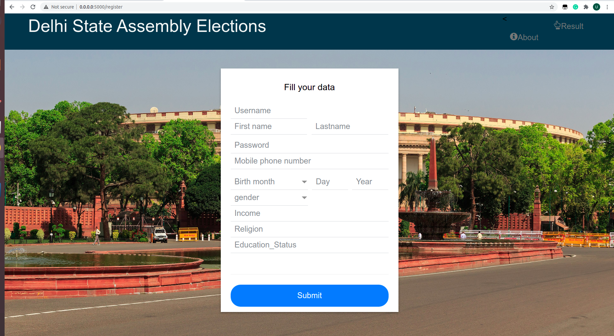
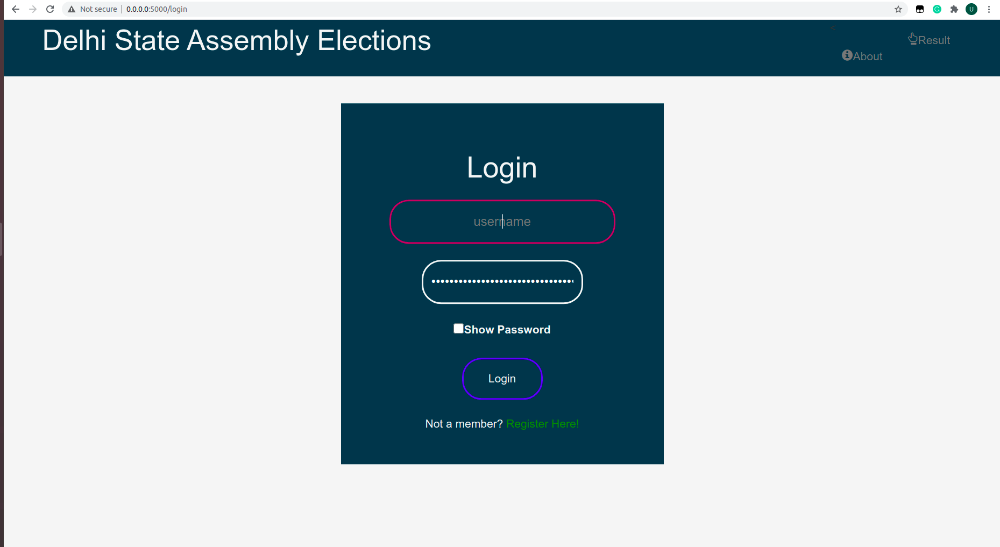
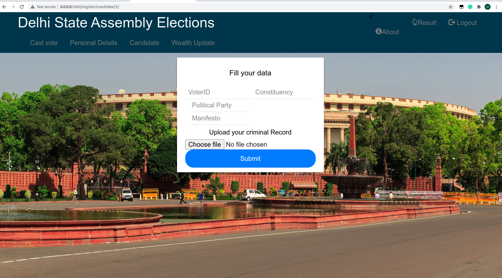
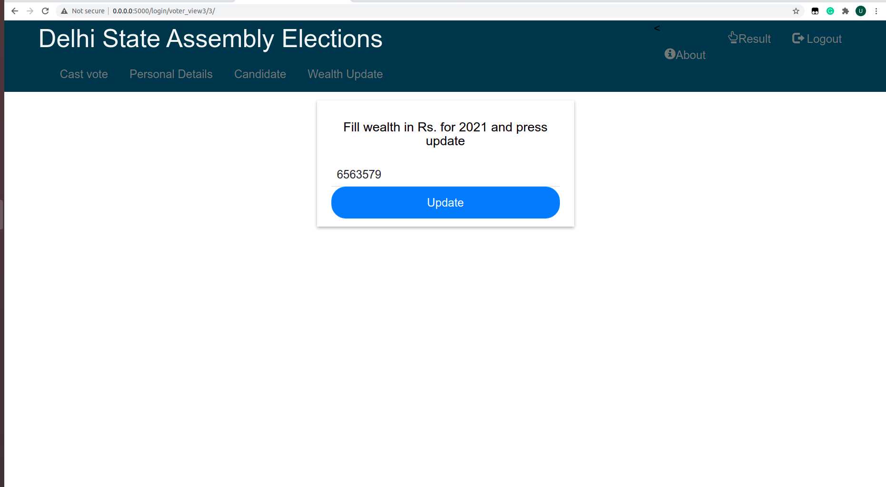
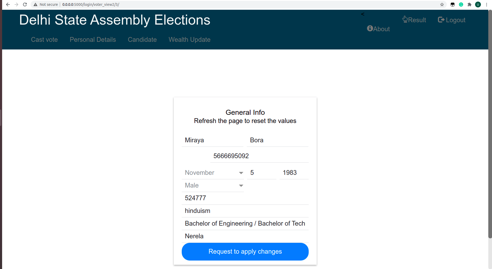
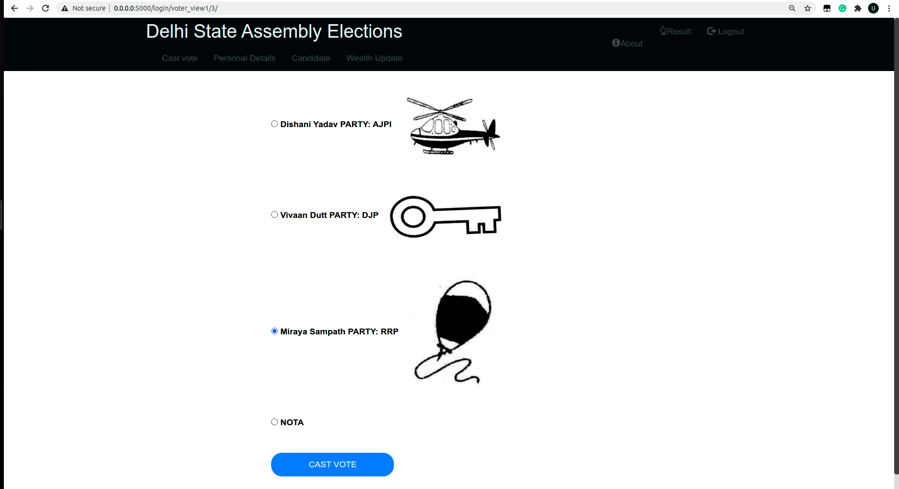

<h1> Web Portal </h1>

<h2>Home page</h2>

<h2>Results page</h2>
Results of previous elections are shown here

<h2>Registration page</h2>
New people can register on this page to get an account. On successfull registration, user gets a unique id which will be used as username. A token will also be provided to be used as password.

<h2>Login page</h2>
Election officials, candidates, voters, verification officials can login here.

<h2>Candidate Registration page</h2>
Candidate can register himself here

<h2>Biodata update page</h2>
Sitting  candidates can provide there wealth info. here annually.

<h2>Info update page</h2>
Voter can update his info. here. His update request will be sent to verification officials.

<h2>Vote Casting page</h2>

NOTE: Tested on Linux.

