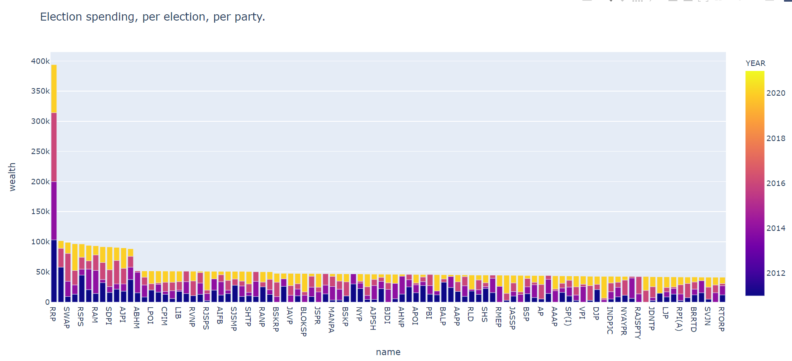

# Project मतदान - An Online Voting System

A mini-world database to manage Delhi elctions on an online platform. This was created as a group project under the course Fundamentals of Database Systems - CSE-202 under the guidance of Dr. Mukesh Mohania.

>## Problem Statement

The Election Commission is planning to conduct state level elections in Delhi.It has approached our organisation MangoDB to create an online portal for this massive undertaking.

Using the Portal :
* Voters vote during the election
* Candidates can register themselves for the election and make/associate with candidates
* Media can fetch data and perform analysis
* Verification Official verifies documents of voters and candidates
* Election Official manages all the activities

>## Stakeholders

The following stakeholders will use our application : 
* Voters 
* Candidates
* Journalists / Media / Common Public
* Election Commission Officials
* Verification Authority

## Features

>### ER Diagram

* Created an ER diagram for designing the database which helped to get a clear idea and decide the various logic elements needed for building the database.
* Created several entities and relationships between the entities which are necessary for organised functioning in a proper manner.
* Includes a few but necessary weak entities and an essential tertiary relationship which reduce several complexities in the project. 
* A snippet of the ER diagram is provided below:


>### [Database Schema](DBMS%20Schema.pdf)

* Created clear and well-defined schemas for all the necessary entities and relationships which were used for populating the DB.
* Database normalisation was done upto Fourth Normal Form(4NF) to eliminate redundancies, insertion, deletion and update anomalies.

>### Database Population

* Made over 10,000+ data entries into the DB.
* Several relations include attributes of `BLOB` data type for storing documents such as aadhaar card of voters, criminal history of candidates etc.

>### Embedded Queries

* Embedded query 2: 


* Embedded query 3: 


># Documents Links 

[Project Document](https://docs.google.com/document/d/1tMQ6hwORqHBMBuoUQeb1csh3gAodjkH4E3jpZh4lMYk/edit?usp=sharing)

[Presentation](https://docs.google.com/presentation/d/1M86weAZjuSAKmUqfPMnHj-YcVd2k5_3MwSiLCBw5juY/edit?usp=sharing)

[DBMS Queries + FAQ](https://docs.google.com/spreadsheets/d/1r87HHesM2Xclg-P8ADvsxNdGmfNkMdP0q-ZdEwrPZfY/edit?usp=sharing)


[References](https://docs.google.com/document/d/1vldJ0R96ztC_2FmJwSfRaSHJMZVHioRtIcHlQOWsYas/edit?usp=sharing)


>## Team Members :
- [Utkrisht](https://github.com/utkrisht-sikka)
- [Krishna](https://github.com/nkrishnasatvik)
- [Shubham](https://github.com/shubham-lohan)
- [Kushal](https://github.com/kushal19057)
- [Bassam](https://github.com/basp0)

>## Steps to make local database from dump file
```
1. Download dump file.
2. Open mysql workbench.
3. On Server menu, click "import data".
4. Select "import from self contained file" option.
5. Provide address of .sql file on local computer.
6. Click on "NEW" button and provide name of schema.
```